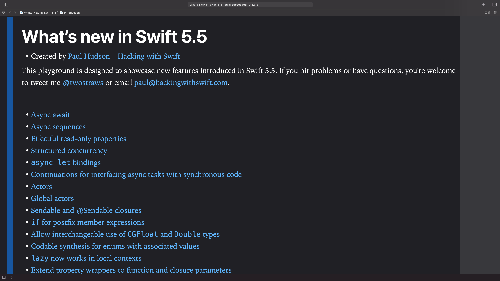

# What’s new in Swift 5.5?

This is an Xcode playground that demonstrates the new features introduced in Swift 5.5: 

 * Async await
 * Async sequences
 * Effectful read-only properties
 * Structured concurrency
 * `async let` bindings
 * Continuations for interfacing async tasks with synchronous code
 * Actors
 * Global actors
 * Sendable and @Sendable closures
 * `if` for postfix member expressions
 * Allow interchangeable use of `CGFloat` and `Double` types
 * Codable synthesis for enums with associated values
 * `lazy` now works in local contexts
 * Extend property wrappers to function and closure parameters
 * Extending static member lookup in generic contexts

This is designed to complement my existing article [What’s New in Swift 5.5](https://www.hackingwithswift.com/articles/233/whats-new-in-swift-5-5). You might also want to read previous articles about the evolution of Swift 5:

- [What’s New in Swift 5.4](https://www.hackingwithswift.com/articles/228/whats-new-in-swift-5-4)
- [What’s New in Swift 5.3](https://www.hackingwithswift.com/articles/212/whats-new-in-swift-5-3)
- [What’s New in Swift 5.2](https://www.hackingwithswift.com/articles/212/whats-new-in-swift-5-2)
- [What’s New in Swift 5.1](https://www.hackingwithswift.com/articles/182/whats-new-in-swift-5-1)
- [What’s New in Swift 5.0](https://www.hackingwithswift.com/articles/126/whats-new-in-swift-5-0)

Alternatively, I have a whole website dedicated to tracking [what's new in Swift](https://www.whatsnewinswift.com) – you should check it out at <https://www.whatsnewinswift.com>.

If you hit problems or have questions, you're welcome to tweet me [@twostraws](https://twitter.com/twostraws) or email <paul@hackingwithswift.com>.

